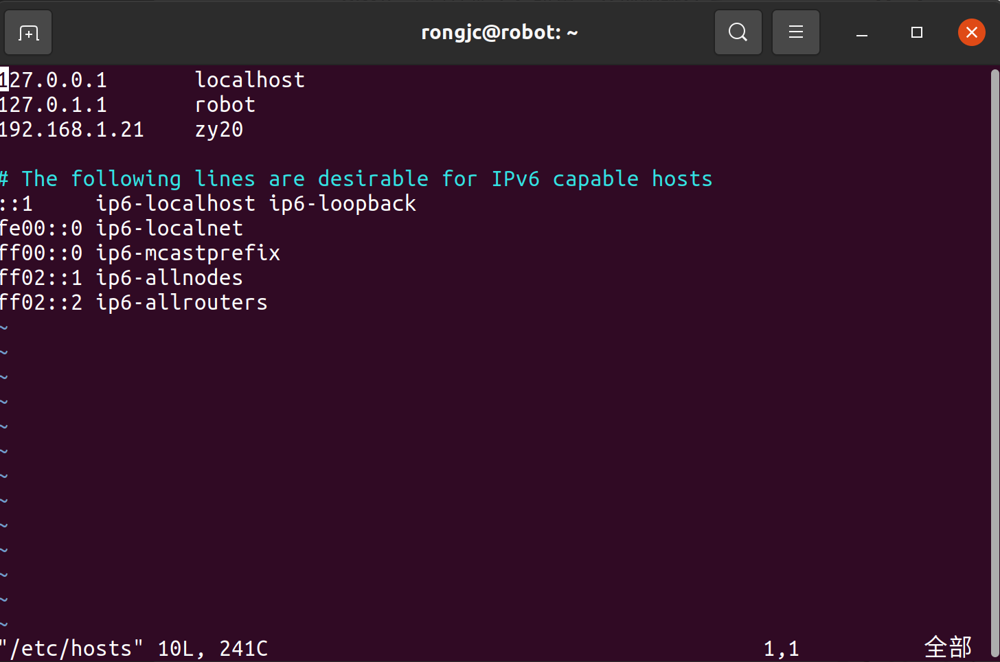
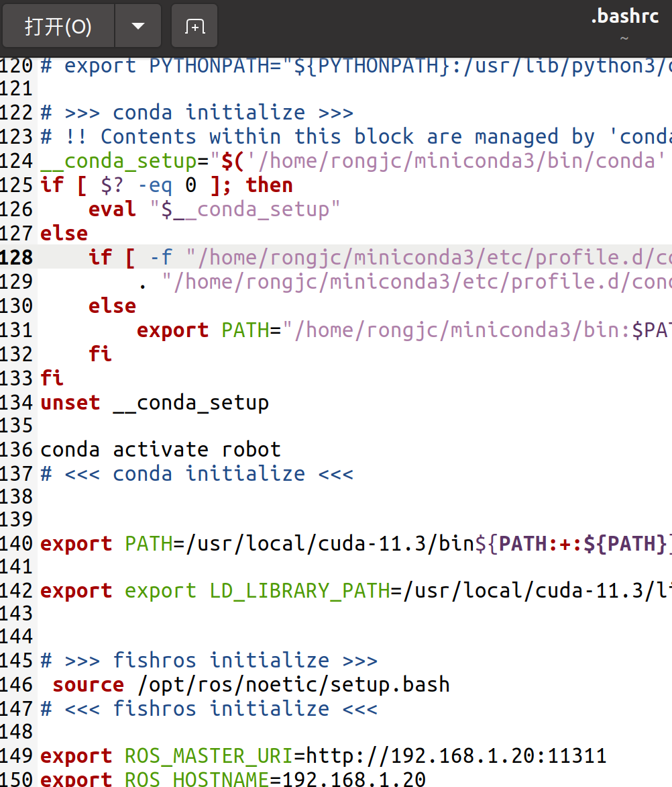

# 1.设置主从机固定IP

地址 192.168.1.20 掩码 255.255.255.0 网关192.168.1.1

# 2.修改hosts文件

主从机分别执行下面操作

```
sudo gedit /etc/hosts
```

添加对方的IP地址和计算机名称



检查是否能够互相ping通

```
ping 192.168.1.21（对方ip）
```

# 3.修改bashrc

## 1）配置主机的bashrc

```
gedit ~/.bashrc
主机端配置 （自己的IP+端口号， 自己的IP）
```

```
export ROS_MASTER_URI=http://主机IP:11311
export ROS_HOSTNAME=主机IP
```




更新环境配置

```
source .bashrc
```


## 2）配置从机的bashrc

```
gedit ~/.bashrc
```


从机端配置 （主机的IP+端口号， 自己的IP）

```
export ROS_MASTER_URI=http://主机IP:11311
export ROS_HOSTNAME=从机IP
```


更新环境配置

```
source .bashrc
```

# 4.演示

## 1）主机：启动订阅速度节点

```cpp
roscore
rosrun turtlesim turtlesim_node 
```

## 2）从机：启动发布键盘控制节点
```cpp
rosrun turtlesim turtle_teleop_key
```


Reference：https://blog.csdn.net/qq_42227760/article/details/130063135
